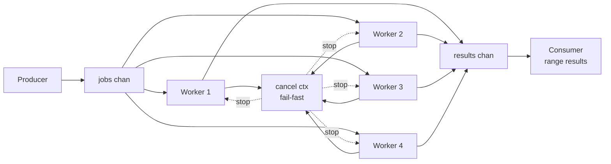

# patterns/workerpool

## Run

```bash
GOCACHE=/tmp/gocache go run ./patterns/workerpool/basic
```

## Benchmark

```bash
GOCACHE=/tmp/gocache go test ./patterns/workerpool/basic -run '^$' -bench .
```

## Flow (visual)



## Notes

- worker pool은 "동시성 제한"과 "작업 큐"를 만들 때 자주 씁니다.
- fail-fast가 필요하면 cancel 전파를 설계하고, 결과/에러 채널 close 책임을 명확히 두세요.
