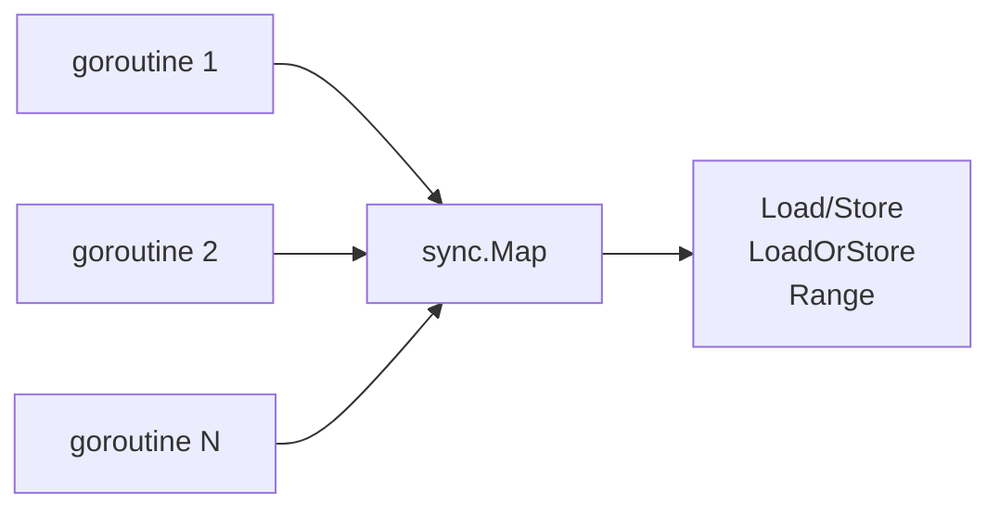

# sync.Map

## Run

```bash
GOCACHE=/tmp/gocache go run ./syncmap/basic
```

```bash
GOCACHE=/tmp/gocache go run ./syncmap/example
```

## Flow (visual)



## Notes

- `sync.Map`은 특정 접근 패턴에서 유리한 concurrent map입니다. 항상 `map+RWMutex`보다 빠르다고 가정하면 안 됩니다.
- “동일 key의 중복 계산 제거”가 필요하면 `singleflight`를 같이 고려하세요.
